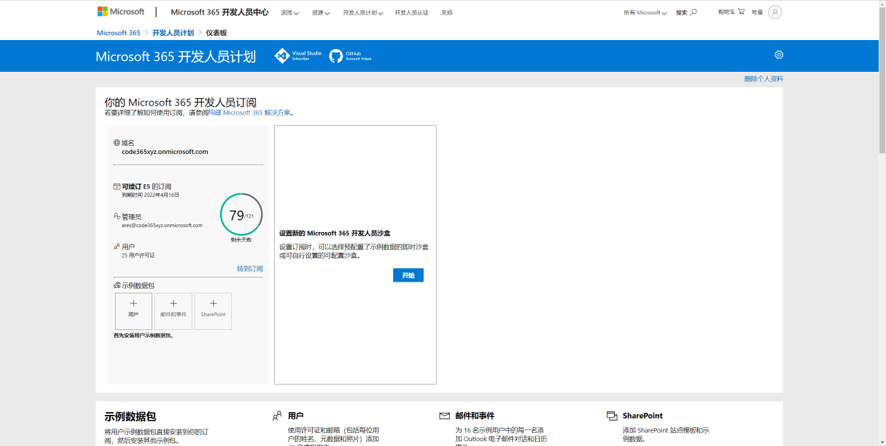

<!--
footer: '**解密和实战 Microsoft Identity Platform**  https://identityplatform.xizhang.com'
-->

# 解密和实战 Microsoft Identity Platform

作者：陈希章
时间：2022年2月


## 概述
<!--为什么要讲这个课程呢-->


这是一个系列课程，将带领大家

1. 了解Microsoft Identity Platform的整体架构和基本概念
1. 通过实例学习在不同的场景下进行应用开发的案例


## 谁适合学习这个教程
<!-- 主要还是为了开发人员，Azure博大精深，这个课程只讲了其中一个很小的部分 -->
1. 项目经理 & 产品经理
1. **开发人员**（公司自研，独立开发商，个人开发者）
1. IT 管理员

## 内容
<!--这个课程后续还可能会更新，每堂课大约30分钟，课程是收费的-->

这个课程分为十个模块，既有文字版，也有视频教程。文字版（演讲稿带备注）请通过 https://identityplatform.xizhang.com 访问，永久免费。

视频教程已发布到网易云课堂，适当收费，请按需取用。[点击这里](https://study.163.com/course/introduction.htm?courseId=1212500806&share=2&shareId=400000000620030) 或扫码访问。


##
<!-- _footer: '' -->


## 课程大纲

1. [基本概念](module1-overview.md)
1. [为单页应用程序集成 （`React`）](module2-spa.md)
1. [为Web应用程序集成 （`Node.js`）](module3-webapp.md)
1. [使用Microsoft Identity 保护Web API （`ASP.NET Core`）](module4-webapi.md)
1. [为移动或桌面应用程序集成 （`Xamarin, WPF`）](module5-desktop-mobile.md)
1. [为守护程序或后端服务集成 (`Azure function +Python，Power Automate`)](module6-deamon-service.md)
1. [Azure AD B2C应用集成 (`React，手机验证码登录和微信登录`） ](module7-b2c.md)
1. [使用 Microsoft Graph API (`Graph explorer & Postman`)](module8-msgraph.md)
1. [使用 Azure AD PowerShell 模块 (`PowerShell`)](module9-powershell.md)
1. [应用管理及最佳实践](module10-bestpractices.md)


## 申请开发者环境
<!-- _footer: '' -->
https://developer.microsoft.com/zh-CN/office/dev-program



## 准备本地开发环境

本教程范例在 `Windows 10` 的环境验证，.NET的版本是`6.0`，Nodejs的版本是 `v16.30.0`

```powershell
# 安装choco这个工具
Set-ExecutionPolicy Bypass -Scope Process -Force; 
[System.Net.ServicePointManager]::SecurityProtocol =[System.Net.ServicePointManager]::SecurityProtocol -bor 3072; 
iex ((New-Object System.Net.WebClient).DownloadString('https://community.chocolatey.org/install.ps1'))

# 安装有关常用软件
choco install dotnet vscode nodejs-lts postman git python -y
# 刷新环境变量，让下面能直接用code命令
refreshenv
# 安装VS Code的插件
code --install-extension MS-CEINTL.vscode-language-pack-zh-hans
# 安装Visual Studio 2022社区版【可选】
choco install visualstudio2022community --locale zh-cn

```

## 熟悉在线工具

1. Graph Explorer <https://aka.ms/ge>
1. JWT 解码器 <https://jwt.ms>
1. Github <https://github.com>

## 课程反馈

你可以通过邮件 <ares@xizhang.com> 与我取得联系，也可以关注 `code365xyz` 这个微信公众号给我留言。

#### 视频教程

[点击这里](https://study.163.com/course/introduction.htm?courseId=1212500806&share=2&shareId=400000000620030) 或扫码可以访问配套视频教程。


陈希章 2022年2月 于上海


