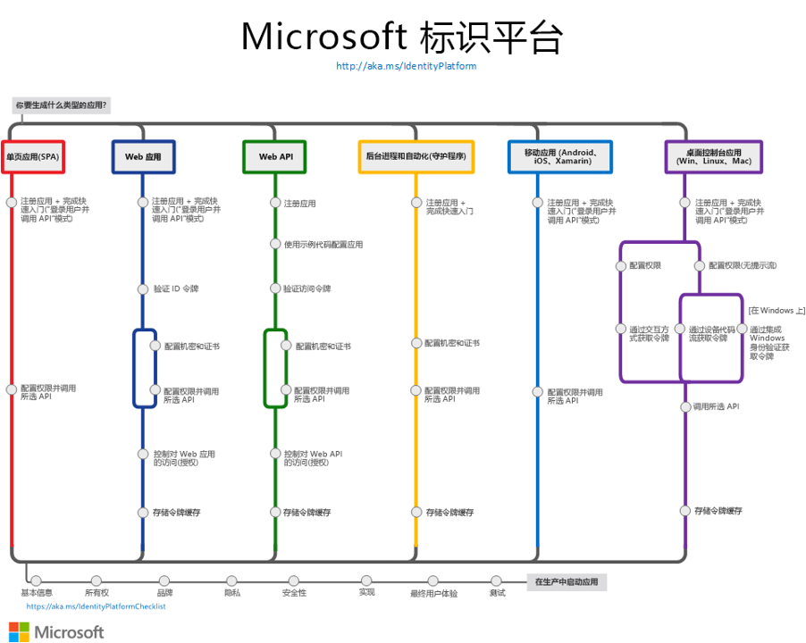

# 解密和实战 Microsoft Identity Platform

作者：陈希章
时间：2022年2月


## 概述
<!--第一页的备注文字-->


这是一个系列课程，将带领大家

1. 了解Microsoft Identity Platform的整体架构和基本概念
1. 通过实例学习在不同的场景下进行应用开发的案例


## 内容
<!--第二页的备注文字-->

这个课程既有文字版，也有视频教程。文字版（演讲稿带备注）请通过 https://identityplatform.xizhang.com 访问，永久免费。视频教程将发布到网易云课堂上面，适当收费，请大家按需取用。

本系列讲座分为十个模块。

###




### 课程大纲

第一讲：基本概念
第二讲：为单页应用程序集成 （React）
第三讲：为Web应用程序集成 （Node.js）
第四讲：使用Microsoft Identity 保护Web API （ASP.NET Core）
第五讲：为移动或桌面应用程序集成 （Xamarin, WPF）
第六讲：为守护程序或后端服务集成 (Azure function +Python，Power Automate)
第七讲：Azure AD B2C应用集成 (React，手机验证码登录和微信登录） 
第八讲：使用 Microsoft Graph API (Graph explorer & Postman)
第九讲：使用 Azure AD PowerShell 模块 (PowerShell)
第十讲：应用管理及最佳实践


## 相关资源

申请开发者账号：https://developer.microsoft.com/zh-CN/office/dev-program

### 准备本地环境

本教程的范例在 `Windows 10` 的环境验证。

```powershell
Set-ExecutionPolicy Bypass -Scope Process -Force; 
[System.Net.ServicePointManager]::SecurityProtocol =[System.Net.ServicePointManager]::SecurityProtocol -bor 3072; 
iex ((New-Object System.Net.WebClient).DownloadString('https://community.chocolatey.org/install.ps1'))

choco install dotnet vscode nodejs-lts postman git –y
code --install-extension MS-CEINTL.vscode-language-pack-zh-hans
choco install visualstudio2022community --locale zh-cn

```

### 熟悉在线工具

1. Graph Explorer <https://aka.ms/ge>
1. JWT 解码器 <https://jwt.ms>
1. Github <https://github.com>

## 课程反馈

你可以通过邮件 <ares@xizhang.com> 与我取得联系，也可以关注 `code365xyz` 这个微信公众号给我留言，还可以在这里 (<https://github.com/chenxizhang/inside-microsoft-identity-platform/discussions>) 给我提出问题或讨论。


<br />

陈希章 于上海
2022年2月

