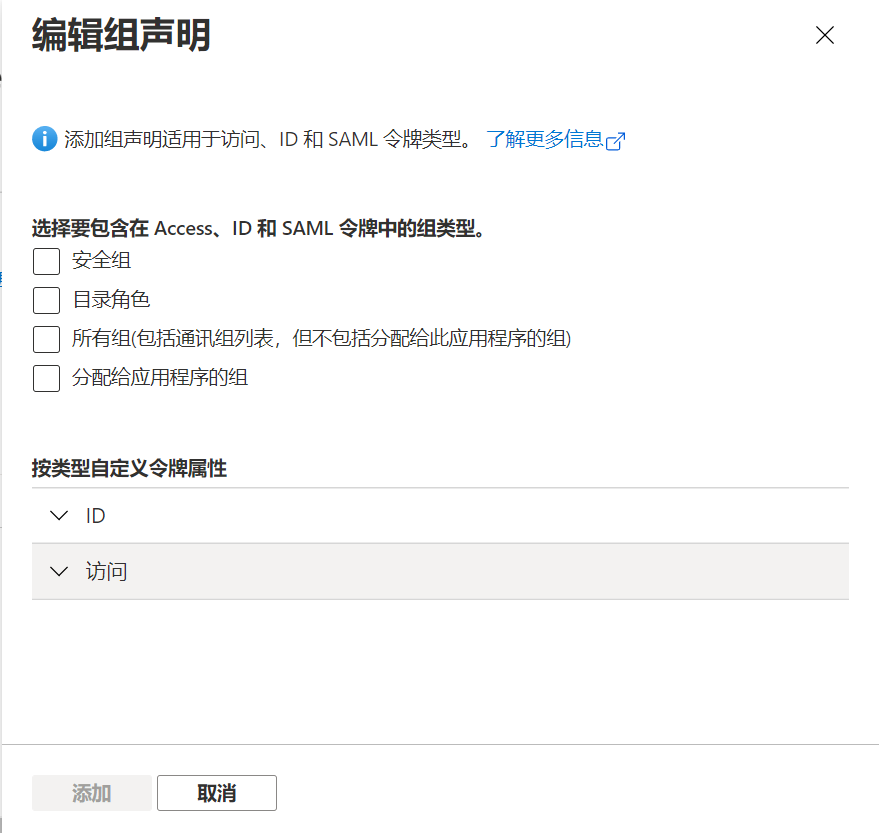

# 第十讲：应用管理及最佳实践
> **解密和实战 Microsoft Identity Platform**  https://identityplatform.xizhang.com


作者：陈希章
时间：2022年2月


## 课程大纲
<!--
footer: '**解密和实战 Microsoft Identity Platform**  https://identityplatform.xizhang.com'
-->

1. [基本概念](module1-overview.md)
1. [为单页应用程序集成 （`React`）](module2-spa.md)
1. [为Web应用程序集成 （`Node.js`）](module3-webapp.md)
1. [使用Microsoft Identity 保护Web API （`ASP.NET Core`）](module4-webapi.md)
1. [为移动或桌面应用程序集成 （`Xamarin, WPF`）](module5-desktop-mobile.md)
1. [为守护程序或后端服务集成 (`Azure function +Python，Power Automate`)](module6-deamon-service.md)
1. [Azure AD B2C应用集成 (`React，手机验证码登录和微信登录`） ](module7-b2c.md)
1. [使用 Microsoft Graph API (`Graph explorer & Postman`)](module8-msgraph.md)
1. [使用 Azure AD PowerShell 模块 (`PowerShell`)](module9-powershell.md)
1. **[应用管理及最佳实践](module10-bestpractices.md)**


##  应用管理及最佳实践

1. 多租户应用
1. 国内版应用
1. 自定义令牌设置

## 多租户应用
1. 注册应用程序
1. 测试应用程序


## 测试多租户应用

请参考第五讲中最后PowerShell的部分。

```powershell
# 安装PowerShell模块
Install-Module MSAL.PS -Scope CurrentUser

# 仅作身份验证, 返回值中IdToken包含了用户基本信息，可以直接解码
$token = Get-MsalToken `
    -ClientId 14308ef0-3c9c-4100-96ba-5d2d805cac0f

# 获取个人基本信息

curl -Uri "https://graph.microsoft.com/v1.0/me" `
    -Headers @{"Authorization"="Bearer $($token.AccessToken)"}

```

## 获取其他资源

1. Microsoft 个人账号能成功授权
1. Microsoft 365 账号可能无法成功授权

```powershell
# 身份验证并且获取其他资源权限
$token = Get-MsalToken `
    -ClientId 14308ef0-3c9c-4100-96ba-5d2d805cac0f `
    -Scopes "Mail.Read Files.Read"

# 获取个人邮件
curl -Uri "https://graph.microsoft.com/v1.0/me/messages" `
    -Headers @{"Authorization"="Bearer $($token.AccessToken)"}

# 获取个人文件
curl -Uri "https://graph.microsoft.com/v1.0/me/drive/root" `
    -Headers @{"Authorization"="Bearer $($token.AccessToken)"}
```


## 多租户应用设置（推荐完成发布者验证）
<!-- _footer: '' -->
<!-- https://docs.microsoft.com/zh-cn/azure/active-directory/develop/publisher-verification-overview -->


## 租户设置 （如果下面这样设置是可以的，但是存在一定的风险）
<!-- https://portal.azure.com/#blade/Microsoft_AAD_IAM/ConsentPoliciesMenuBlade/UserSettings -->


## 请求管理员同意

`https://login.microsoftonline.com/ab7d3ddf-d9bf-465f-83dc-49833f69440f/v2.0/adminconsent?client_id=14308ef0-3c9c-4100-96ba-5d2d805cac0f&state=12345&redirect_uri=http://localhost&scope=Mail.Read Files.Read`


## 国内版应用开发

1. 门户 https://portal.azure.cn/#blade/Microsoft_AAD_IAM/ActiveDirectoryMenuBlade
1. 登录（Authority） https://login.partner.microsoftonline.cn
1. Microsoft Graph 端点地址 https://microsoftgraph.chinacloudapi.cn


## 国内版应用开发（使用PowerShell）

```powershell
# 关于使用PowerShell,请参考第五讲结尾部分
Install-Module MSAL.PS -Scope CurrentUser

$app = New-MsalClientApplication `
    -ClientId 2b183a93-03a2-46a3-bc06-4711e57d2caa `
    -AzureCloudInstance AzureChina `
    -Authority https://login.partner.microsoftonline.cn/2dce9a6e-6fe1-4dc8-ac10-f571cdefc583


Get-MsalToken `
    -PublicClientApplication $app `
    -Scopes "https://microsoftgraph.chinacloudapi.cn/.default"

```


## 自定义令牌

1. 配置令牌属性
1. 配置令牌生命有效期

###  自定义令牌属性
<!-- https://docs.microsoft.com/zh-cn/azure/active-directory/develop/id-tokens -->
<!-- _footer: ''--> 



<!-- 
勾选上了组的话，groups是安全组编号（可以通过这里找到 https://aad.portal.azure.com/#blade/Microsoft_AAD_IAM/GroupsManagementMenuBlade/AllGroups），
wids是系统角色编号，所有这些编号，在每个租户都是固定的，通过  Get-AzureADDirectoryRoleTemplate 可以获取到
自定义令牌，组属性中，注意有一个显示为role的选项
{
  "typ": "JWT",
  "alg": "RS256",
  "kid": "Mr5-AUibfBii7Nd1jBebaxboXW0"
}.{
  "aud": "1b87e032-fd57-4f67-b2f3-d9ff5e1c583f",
  "iss": "https://login.microsoftonline.com/3a6831ab-6304-4c72-8d08-3afe544555dd/v2.0",
  "iat": 1645428113,
  "nbf": 1645428113,
  "exp": 1645432013,
  "groups": [
    "b956c237-7c9a-4ff5-bfff-79a832b0c4bf",
    "6b759766-2ecb-4299-b31f-965ef23f2931",
    "da86cab9-1cee-4456-b9e2-b18615b023ca",
    "c17dcde0-5dba-4cc8-b7df-5d2390069de4",
    "7467cf68-fa42-473d-9f2e-c3d72e9620ee"
  ],
  "name": "希章",
  "oid": "b238fd07-6513-46b0-b133-55c9ff8b09e9",
  "preferred_username": "ares@code365.xyz",
  "rh": "0.AXAAqzFoOgRjckyNCDr-VEVV3TLghxtX_WdPsvPZ_14cWD9wAAY.",
  "sub": "xE4rtpK7Ro2qbhjqCh6AX3w18ETIVGHYE0YG03TZqCY",
  "tid": "3a6831ab-6304-4c72-8d08-3afe544555dd",
  "uti": "R5k7foDhLEyokhm9eWklAQ",
  "ver": "2.0",
  "wids": [
    "62e90394-69f5-4237-9190-012177145e10",
    "b79fbf4d-3ef9-4689-8143-76b194e85509"
  ]
}.[Signature]

 -->


### 配置令牌生命周期

1. 使用此功能需要 Azure AD Premium P1 许可证
1. 默认是两小时。

```powershell
Install-Module AzureADPreview

Connect-AzureAD -Confirm
# 创建一个策略
$policy = New-AzureADPolicy `
    -Definition @('{"TokenLifetimePolicy":{"Version":1,"AccessTokenLifetime":"02:00:00"}}') `
    -DisplayName "WebPolicyScenario" `
    -IsOrganizationDefault $false -Type "TokenLifetimePolicy"

# 获取某个企业应用程序的引用
$sp = Get-AzureADServicePrincipal `
    -Filter "DisplayName eq '<service principal display name>'"

# 为该应用程序指派该策略
Add-AzureADServicePrincipalPolicy `
    -Id $sp.ObjectId `
    -RefObjectId $policy.Id

```

## 课程反馈

你可以通过邮件 <ares@xizhang.com> 与我取得联系，也可以关注 `code365xyz` 这个微信公众号给我留言。

#### 视频教程

[点击这里](https://study.163.com/course/introduction.htm?courseId=1212500806&share=2&shareId=400000000620030) 或扫码可以访问配套视频教程。


陈希章 2022年2月 于上海