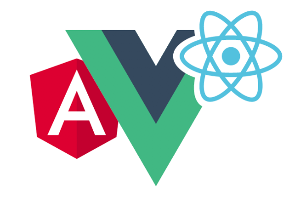
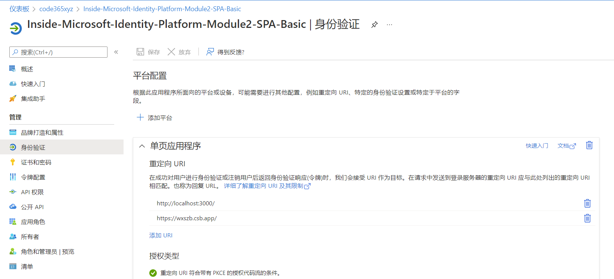
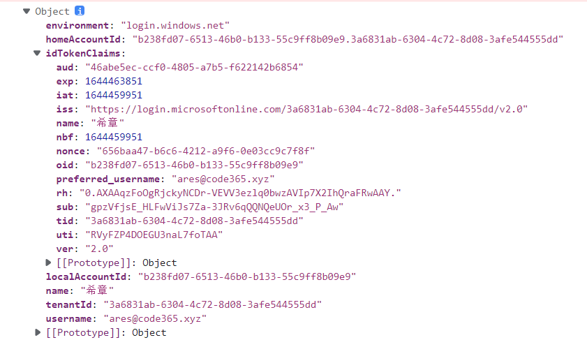
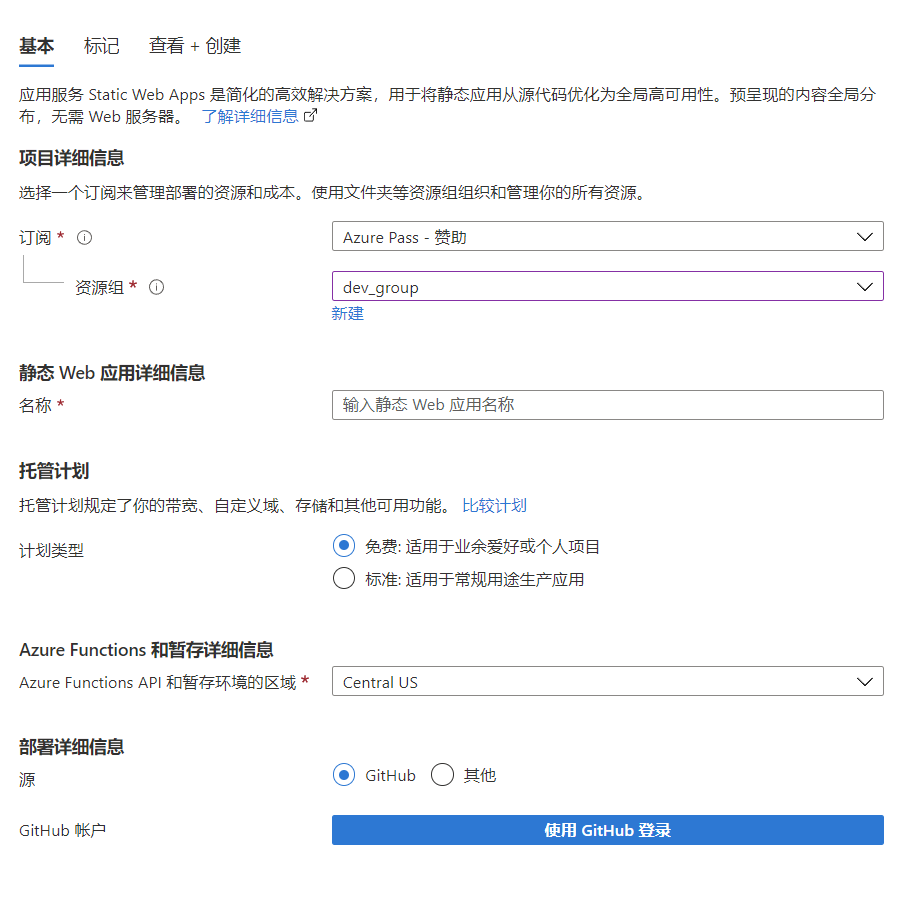
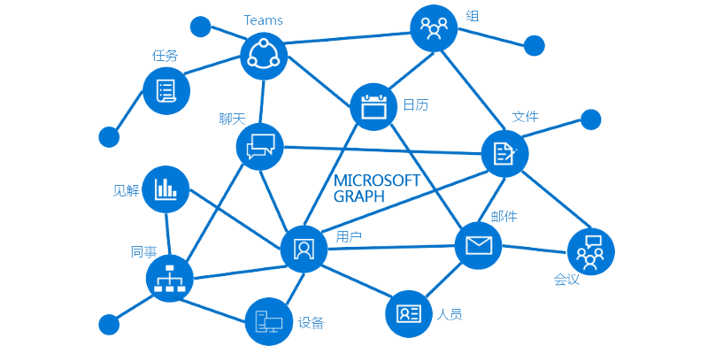
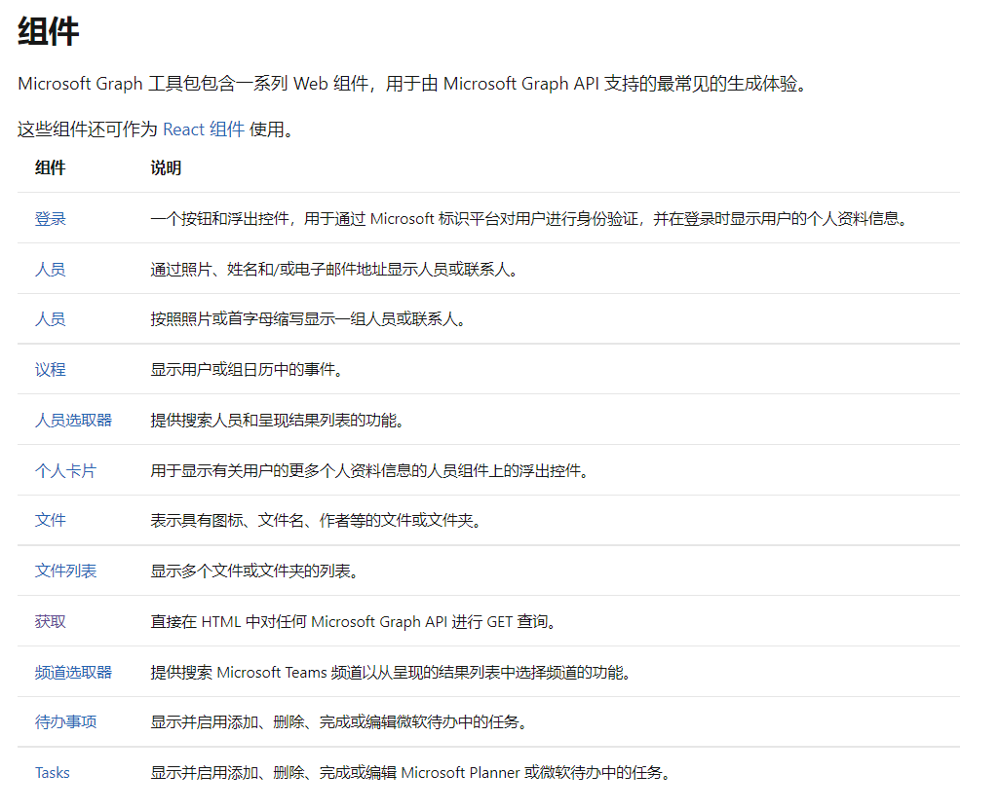
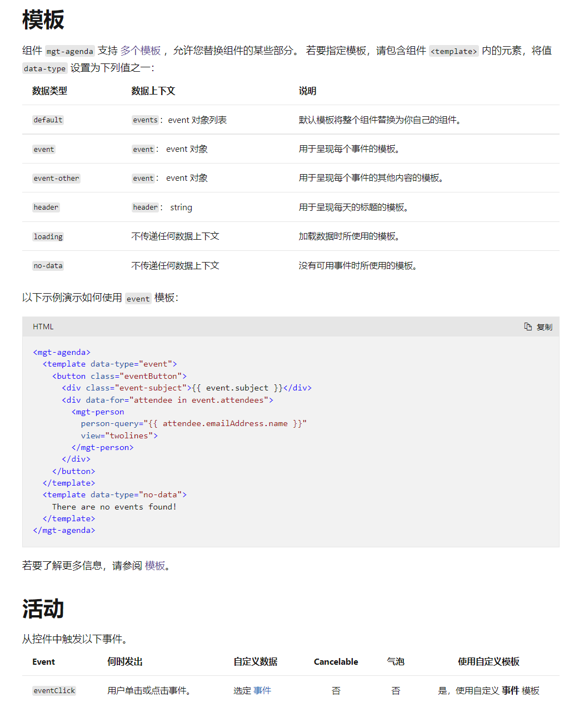

# 第二讲：为单页应用程序集成
> **解密和实战 Microsoft Identity Platform**  https://identityplatform.xizhang.com


作者：陈希章
时间：2022年2月


## 课程大纲
<!--
footer: '**解密和实战 Microsoft Identity Platform**  https://identityplatform.xizhang.com'
-->

1. [基本概念](module1-overview.md)
1. **[为单页应用程序集成 （`React`）](module2-spa.md)**
1. [为Web应用程序集成 （`Node.js`）](module3-webapp.md)
1. [使用Microsoft Identity 保护Web API （`ASP.NET Core`）](module4-webapi.md)
1. [为移动或桌面应用程序集成 （`Xamarin, WPF`）](module5-desktop-mobile.md)
1. [为守护程序或后端服务集成 (`Azure function +Python，Power Automate`)](module6-deamon-service.md)
1. [Azure AD B2C应用集成 (`React，手机验证码登录和微信登录`） ](module7-b2c.md)
1. [使用 Microsoft Graph API (`Graph explorer & Postman`)](module8-msgraph.md)
1. [使用 Azure AD PowerShell 模块 (`PowerShell`)](module9-powershell.md)
1. [应用管理及最佳实践](module10-bestpractices.md)

## <!-- fit --> 单页应用程序 

1. 一个页面 + 客户端路由
1. 用Javascript编写界面
1. 组件化，局部刷新



<br />

:heart: 本教程使用React 

## 为单页应用程序集成

1. 注册应用程序
1. 创建React项目（本地或Codesandbox）
1. 使用MSAL-react实现用户身份验证
1. 通过Azure静态网站托管，使用内置支持
1. 实现对Microsoft Graph资源的访问
1. 与Microsoft Graph toolkit 集成


## 注册应用程序



## 创建React项目
1. 本地 `npx create-react-app spa-basic --template typescript`
1. https://codesandbox.io


>安装 `@azure/msal-browser` 和`@azure/msal-react` 两个包

## 使用MSAL-react实现用户身份验证

1. 初始化应用程序
1. 处理登录（login）和注销（logout）
    - 弹出对话框
    - 页面重定向


### 初始化

```typescript
import { render } from "react-dom";
import { PublicClientApplication } from "@azure/msal-browser";
import { MsalProvider } from "@azure/msal-react";
import App from "./App";

const instance = new PublicClientApplication({
  auth: {
    clientId: "46abe5ec-ccf0-4805-a7b5-f622142b6854",
    authority://如果是多租户应用，则为 /common
      "https://login.microsoftonline.com/3a6831ab-6304-4c72-8d08-3afe544555dd"
  },
  cache: {
    cacheLocation: "sessionStorage"//还可以设置为localStorage
  }
});

const rootElement = document.getElementById("root");
render(
  <MsalProvider instance={instance}>
    <App />
  </MsalProvider>,
  rootElement
);
```
### 处理登录（Login）和注销（Logout）

```typescript
function handleLogin(instance: IPublicClientApplication): void {
  instance
    .loginPopup()
    .then((v) => instance.setActiveAccount(v.account))
    .catch((reason) => alert(reason));
}

function handleLogout(instance: IPublicClientApplication): void {
  instance.logoutPopup();
}
```

请注意，还有 `loginRedirect` 和 `logoutRedirect`，但是在某些情况下是不能重定向的

### 账号信息

登录成功后可以获得如下的基本信息

```typescript
export declare type AccountInfo = {
    homeAccountId: string;
    environment: string;
    tenantId: string;
    username: string;
    localAccountId: string;
    name?: string;
    idTokenClaims?: object;
};
```



## 通过Azure静态网站托管
<!-- footer: 详情请参考 https://docs.microsoft.com/zh-cn/azure/static-web-apps/ -->

基于Github进行CI&CD，内置各种模板，以及安全支持，现代静态网站（React+API）




### 配置安全性
<!-- 
默认的那个登录页面是英文的，而且无法定制，如果要支持自定义验证，也很简单，请参考 https://docs.microsoft.com/en-us/azure/static-web-apps/authentication-custom?tabs=aad
1. 注册一个应用程序，添加一个密钥
1. 选择Web应用程序，redirect地址是：https://icy-pebble-04e0d6900.1.azurestaticapps.net/.auth/login/aad/callback
1. 勾选上 隐式授权中的 id_token 这个选项

配置文件中添加
    "auth": {
        "identityProviders": {
            "azureActiveDirectory": {
                "registration": {
                    "openIdIssuer": "https://login.microsoftonline.com/3a6831ab-6304-4c72-8d08-3afe544555dd/v2.0",
                    "clientIdSettingName": "AZURE_CLIENT_ID",
                    "clientSecretSettingName": "AZURE_CLIENT_SECRET"
                }
            }
        }
    },

在静态网站启用标准价格层（这样才能支持自定义），然后添加配置项 AZURE_CLIENT_ID 和 AZURE_CLIENT_SECRET
 -->
在网站根目录下面创建 staticwebapp.config.json，默认支持 `aad`,`github`, `twitter`三种验证器，也支持自定义 OpenID Connect 提供程序。

```json
{
    "routes": [
        {
            "route": "/*",
            "allowedRoles": [
                "authenticated"
            ]
        }
    ],
    "responseOverrides": {
        "401": {
            "statusCode": 302,
            "redirect": "/.auth/login/aad"
        }
    }
}

```


### 在 React 应用中获取当前用户信息

在前端代码中直接请求一个特定的地址，就可以获取到当前用户信息。该信息其实是以Cookie保存在浏览器中的。请注意，这里的用户id 并不是用户在AAD中真正的id，而是每个应用都不一样的，有点类似于微信开发中的openid.


```javascript

async function getUserInfo() {
    const response = await fetch('/.auth/me');
    const payload = await response.json();
    const { clientPrincipal } = payload;
    return clientPrincipal;
}

```
### 在 API 应用中获取当前用户信息

Azure 静态 Web 应用通过 Azure Functions 提供无服务器 API 终结点，如果网站启用了身份验证，则会自动地在头部中传递加密过的用户信息

```javascript
module.exports = async function (context, req) {
  const header = req.headers['x-ms-client-principal'];
  const encoded = Buffer.from(header, 'base64');
  const decoded = encoded.toString('ascii');

  context.res = {
    body: {
      clientPrincipal: JSON.parse(decoded),
    },
  };
};
```

## 实现对Microsoft Graph资源的访问
<!-- footer: 详情请参考 https://docs.microsoft.com/zh-cn/graph/overview -->
1. 获取access_token
1. 使用SDK访问资源



### 获取 access_token

```typescript
const getToken = async (
  instance: IPublicClientApplication,
  scopes: string[]
): Promise<string> => {
  const request = { scopes: scopes };
  try {
    const result = await instance.acquireTokenSilent(request);
    return result.accessToken;
  } catch (error) {
    try {
      const result = await instance.acquireTokenPopup(request);
      return result.accessToken;
    } catch (error) {
      throw error;
    }
  }
};

```

### 使用SDK 访问资源

安装 `@microsoft/microsoft-graph-client` 和 `@microsoft/microsoft-graph-types`

```typescript
import { Client } from "@microsoft/microsoft-graph-client";
import { Message, User } from "@microsoft/microsoft-graph-types";

async function getUserProfile(token: string) {
  const client = Client.init({
    authProvider: (done) => done(undefined, token)
  });
  return client.api("/me").get();
}
```
## 与 Microsoft Graph toolkit 集成
<!-- footer: 详情请参考  https://docs.microsoft.com/zh-cn/graph/toolkit/overview  -->

1. 官方提供组件,缩短开发时间
    ```
    @microsoft/mgt-element
    @microsoft/mgt-msal2-provider
    @microsoft/mgt-react
    @microsoft/microsoft-graph-types
    ```
1. 美观而灵活，模板可定制
1. 事件监听




### 初始化 （一般在Index.tsx中）

```javascript
import { Providers } from "@microsoft/mgt-element";
import { Msal2Provider } from "@microsoft/mgt-msal2-provider";

Providers.globalProvider = new Msal2Provider({
  clientId: "397b5acf-6a97-4307-a87e-b8e691e54d41",
  authority:
    "https://login.microsoftonline.com/3a6831ab-6304-4c72-8d08-3afe544555dd",
  loginType: 0,
  scopes: ["User.Read", "Mail.Read"]
});
```

### 使用组件

```javascript
import {Login,Agenda,FileList,People,Providers,ProviderState,} from "@microsoft/mgt-react";

function useIsSignIn(): [boolean] {
  const [isSignIn, setIsSignIn] = useState(false);
  useEffect(() => {
    const updateState = () => {
      const provider = Providers.globalProvider;
      setIsSignIn(provider && provider.state === ProviderState.SignedIn);
    };

    Providers.onProviderUpdated(updateState);
    updateState();
    return () => Providers.removeProviderUpdatedListener(updateState);
  }, []);

  return [isSignIn];
}
```
### 定制模板和监听事件

1. 通过模板定制组件展现样式
1. 通过监听事件响应用户操作



### 自定义查询 （使用Get组件）

```javascript 
// 定义一个模板来显示邮件
const EmailItem = (props: MgtTemplateProps) => {
  const message: Message = props.dataContext;
  return <div>{message.subject}</div>;
};

// 在界面合适地方使用Get组件
<Get scopes={["Mail.Read"]} resource="/me/messages">
    <EmailItem template="value" />
</Get>
```

## 课程反馈
<!--
footer: '**解密和实战 Microsoft Identity Platform**  https://identityplatform.xizhang.com'
-->
你可以通过邮件 <ares@xizhang.com> 与我取得联系，也可以关注 `code365xyz` 这个微信公众号给我留言，还可以在这里 (<https://github.com/chenxizhang/inside-microsoft-identity-platform/discussions>) 给我提出问题或讨论。


陈希章 于上海
2022年2月