# 第七讲：Azure AD B2C应用集成 
> **解密和实战 Microsoft Identity Platform**  https://identityplatform.xizhang.com


作者：陈希章
时间：2022年2月


## 课程大纲
<!--
footer: '**解密和实战 Microsoft Identity Platform**  https://identityplatform.xizhang.com'
-->

1. [基本概念](module1-overview.md)
1. [为单页应用程序集成 （`React`）](module2-spa.md)
1. [为Web应用程序集成 （`Node.js`）](module3-webapp.md)
1. [使用Microsoft Identity 保护Web API （`ASP.NET Core`）](module4-webapi.md)
1. [为移动或桌面应用程序集成 （`Xamarin, WPF`）](module5-desktop-mobile.md)
1. [为守护程序或后端服务集成 (`Azure function +Python，Power Automate`)](module6-deamon-service.md)
1. **[Azure AD B2C应用集成 (`React，手机验证码登录和微信登录`） ](module7-b2c.md)**
1. [使用 Microsoft Graph API (`Graph explorer & Postman`)](module8-msgraph.md)
1. [使用 Azure AD PowerShell 模块 (`PowerShell`)](module9-powershell.md)
1. [应用管理及最佳实践](module10-bestpractices.md)

## <!-- fit -->  Azure AD B2C应用集成
1. 创建租户
1. 选择身份提供程序
1. 定义用户流
1. 注册应用程序
1. 编程访问

##  创建租户

1. 需要有一个合法的订阅
1. 会产生少量每月费用

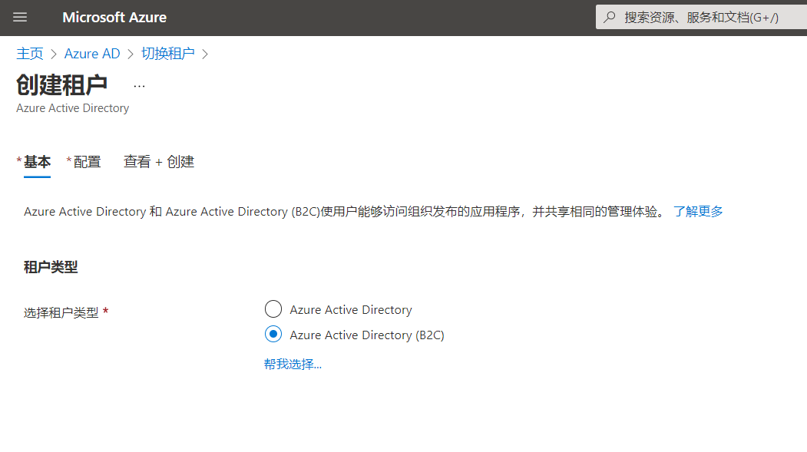
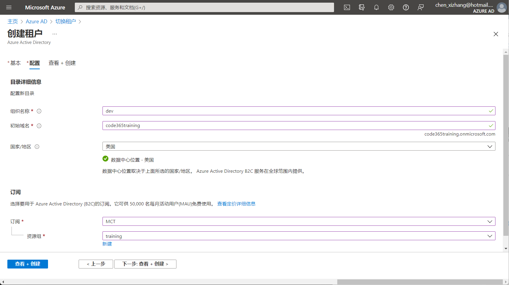


## 创建租户 （续）
<!-- _footer: '' -->
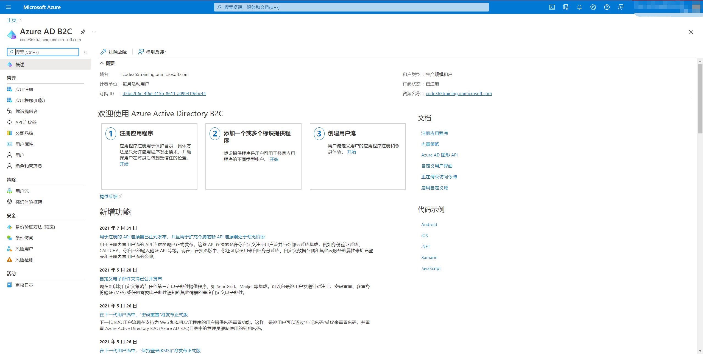

## 配置身份提供程序

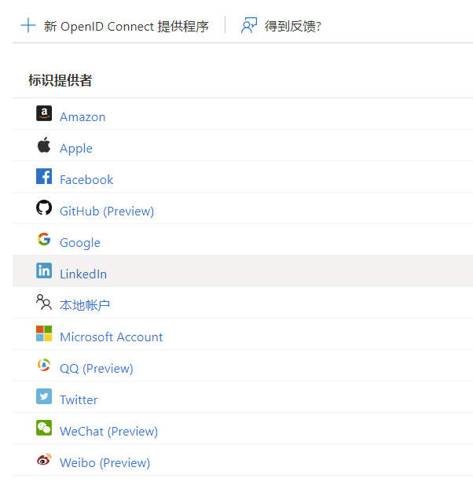

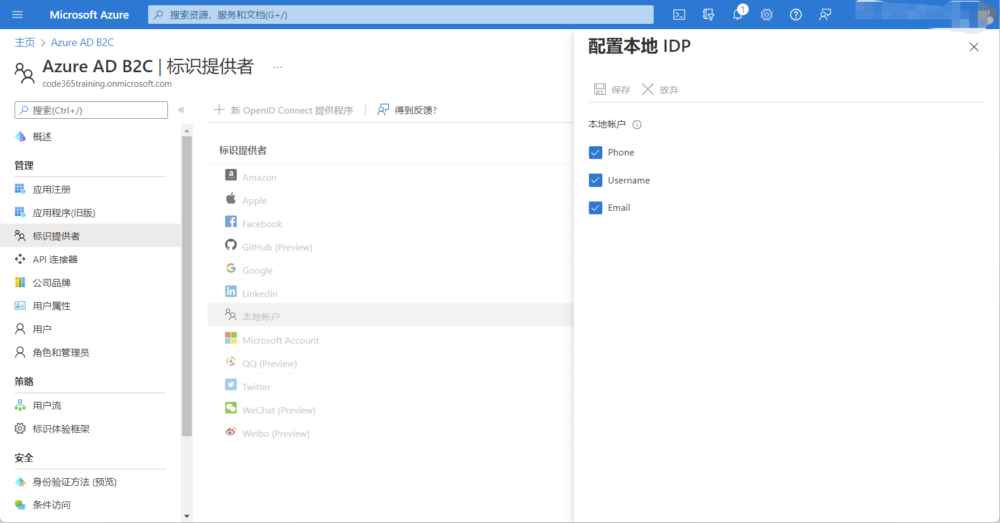
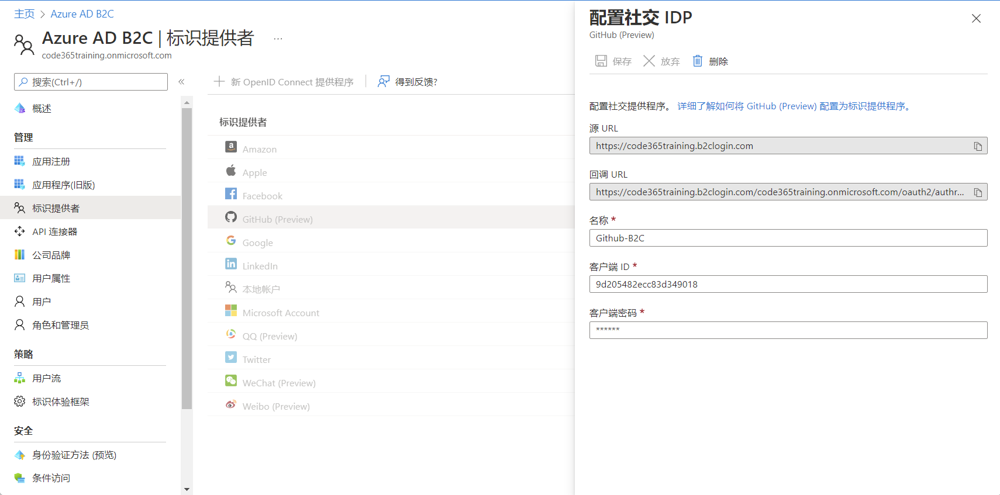 

## 添加用户流

定义用户如何注册，登录，注销，密码重置等选项

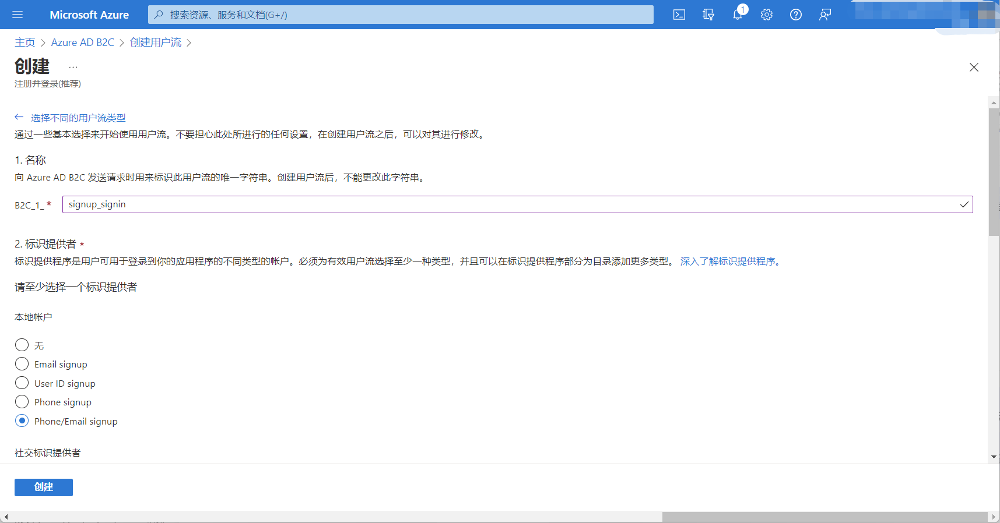
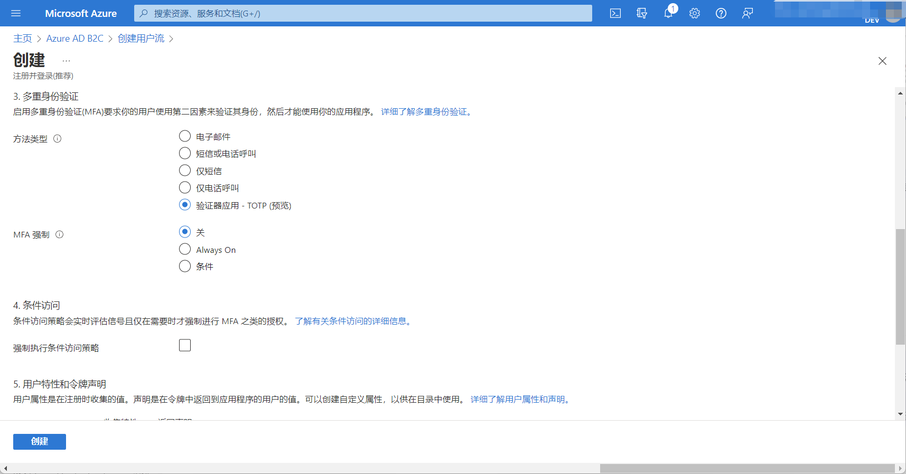
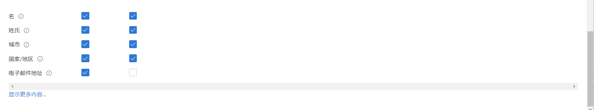


## 注册应用程序
1. 该应用程序一般只用来身份验证
1. 权限是受限的
<!-- _footer: '' -->
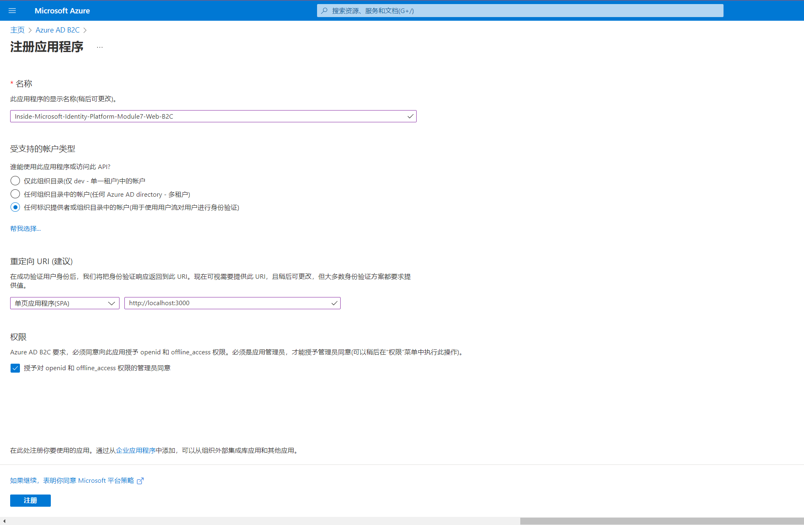
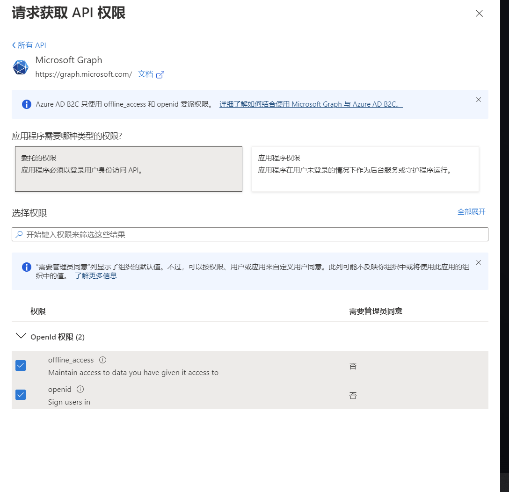


## 在前端应用中调用

使用标准的 MSAL 库即可，注意 `authority` 和 `knownAuthorities` 的设置 
<!-- _footer: '' -->
```tsx
import { render } from "react-dom";
import { PublicClientApplication } from "@azure/msal-browser";
import { MsalProvider } from "@azure/msal-react";
import App from "./App";

const instance = new PublicClientApplication({
  auth: {
    clientId: "ffbe62b6-9f78-41fc-8ce7-e8f1a4123196",
    authority:
      "https://code365training.b2clogin.com/code365training.onmicrosoft.com/B2C_1_signup_signin",
    knownAuthorities: ["code365training.b2clogin.com"]
  },
  cache: {
    cacheLocation: "sessionStorage"
  }
});

const rootElement = document.getElementById("root");
render(
  <MsalProvider instance={instance}>
    <App />
  </MsalProvider>,
  rootElement
);
```

## 在前端应用中调用
<!-- _footer: '' -->
<!-- 范例 https://codesandbox.io/s/module7-spa-b2c-dnvqu -->

```tsx
import "./styles.css";
import { useMsal } from "@azure/msal-react";
import { useState } from "react";
import { AccountInfo } from "@azure/msal-common";
export default function App() {
  const { instance } = useMsal();
  const [account, setAccount] = useState<AccountInfo>();
  return (
    <div className="App">
      <button
        onClick={() => {
          instance
            .loginPopup()
            .then((v) => {
              if (v.account) setAccount(v.account);
            })
            .catch((reason) => alert(reason));
        }}
      >请登录</button>
      {account && <pre>{JSON.stringify(account.idTokenClaims)}</pre>}
    </div>
  );
}
```
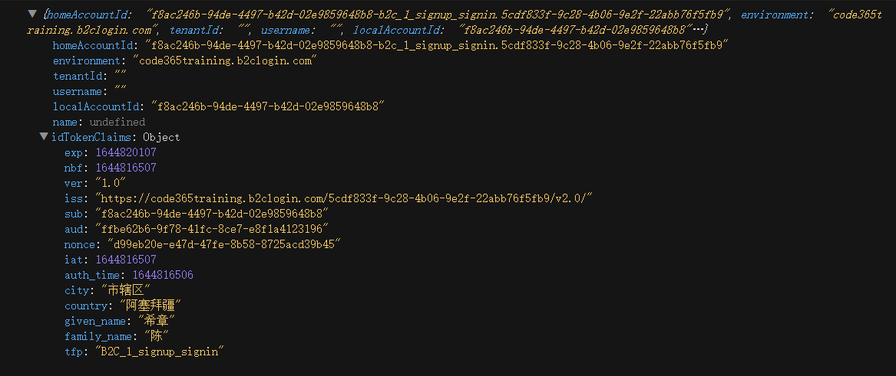
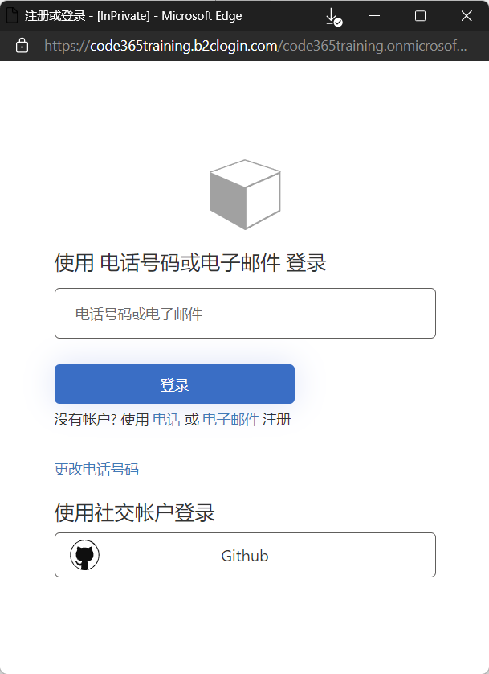
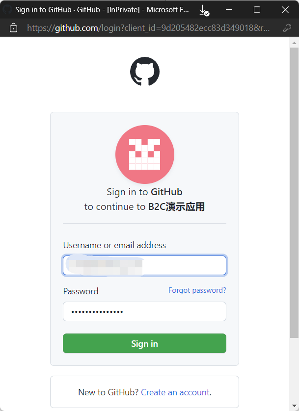

## 课程反馈

你可以通过邮件 <ares@xizhang.com> 与我取得联系，也可以关注 `code365xyz` 这个微信公众号给我留言，还可以在这里 (<https://github.com/chenxizhang/inside-microsoft-identity-platform/discussions>) 给我提出问题或讨论。


陈希章 于上海
2022年2月