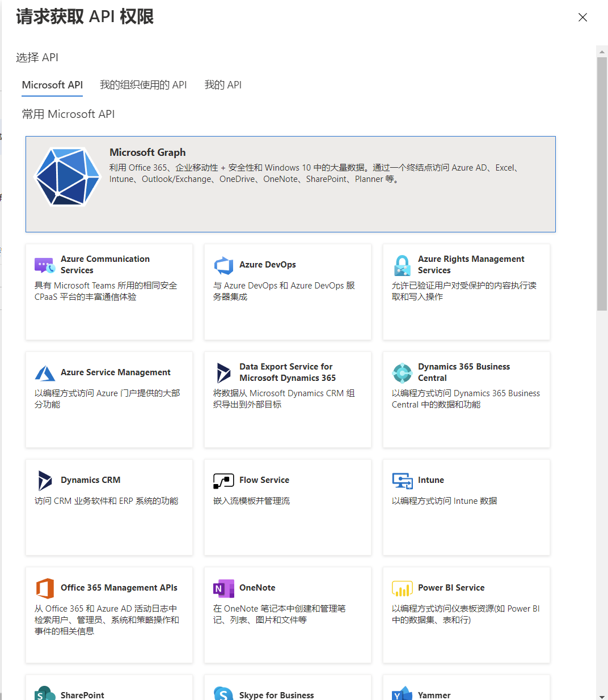
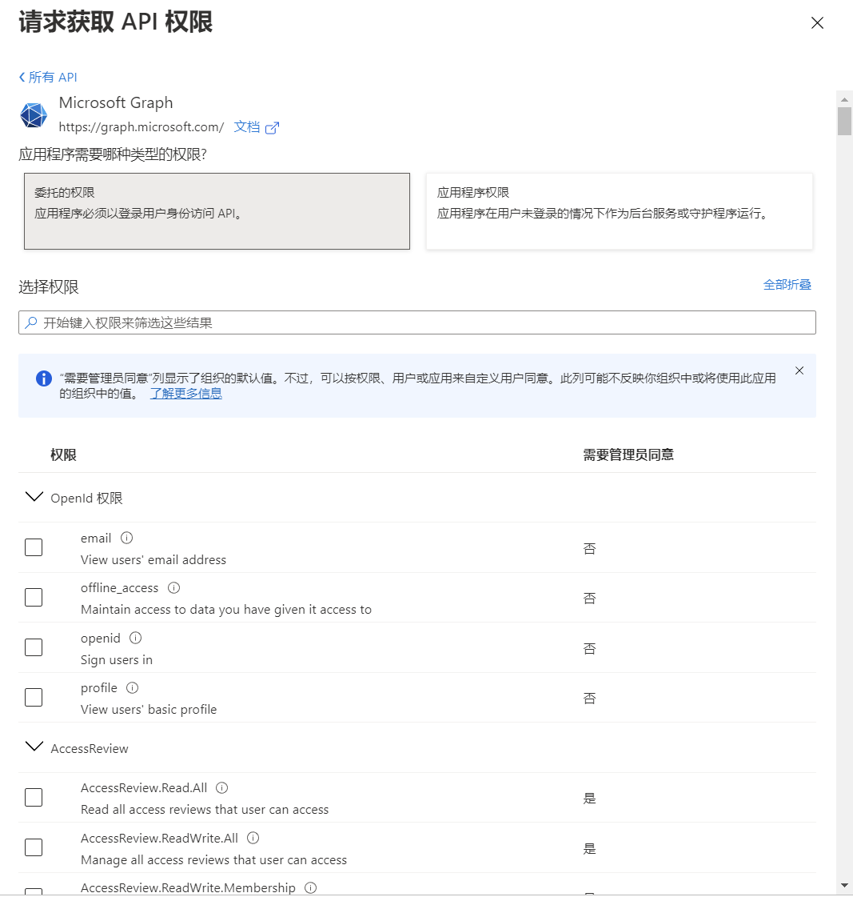
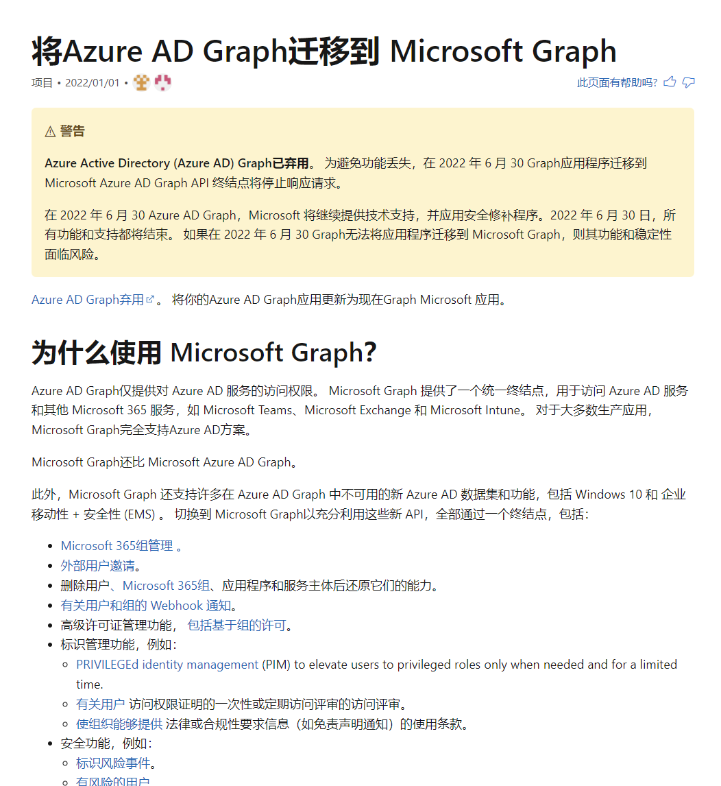
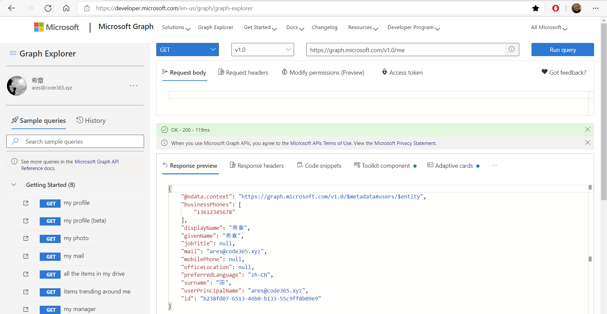
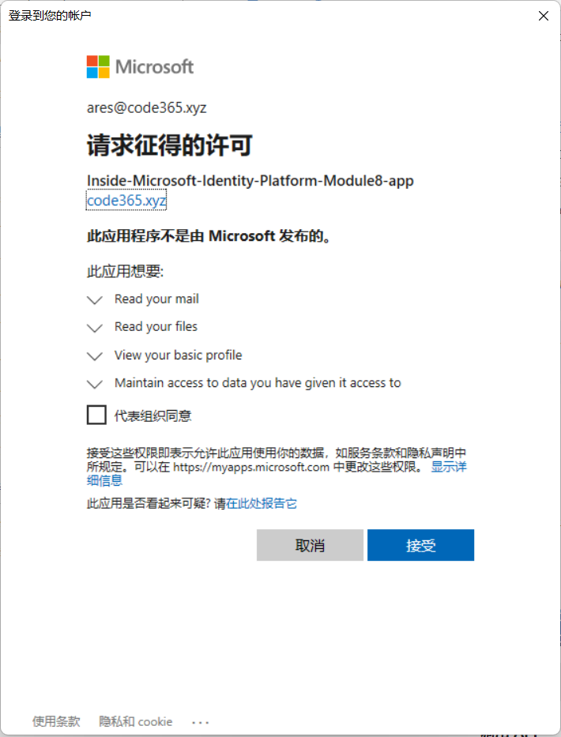

# 第八讲：使用 Microsoft Graph API 
> **解密和实战 Microsoft Identity Platform**  https://identityplatform.xizhang.com


作者：陈希章
时间：2022年2月


## 课程大纲
<!--
footer: '**解密和实战 Microsoft Identity Platform**  https://identityplatform.xizhang.com'
-->

1. [基本概念](module1-overview.md)
1. [为单页应用程序集成 （`React`）](module2-spa.md)
1. [为Web应用程序集成 （`Node.js`）](module3-webapp.md)
1. [使用Microsoft Identity 保护Web API （`ASP.NET Core`）](module4-webapi.md)
1. [为移动或桌面应用程序集成 （`Xamarin, WPF`）](module5-desktop-mobile.md)
1. [为守护程序或后端服务集成 (`Azure function +Python，Power Automate`)](module6-deamon-service.md)
1. [Azure AD B2C应用集成 (`React，手机验证码登录和微信登录`） ](module7-b2c.md)
1. **[使用 Microsoft Graph API (`Graph explorer`)](module8-msgraph.md)**
1. [使用 Azure AD PowerShell 模块 (`PowerShell`)](module9-powershell.md)
1. [应用管理及最佳实践](module10-bestpractices.md)


## <!-- fit -->使用 Microsoft Graph API

这是我们努力学习Microsoft Identity Platform的一个主要原因

1. 理解资源和权限
1. 用户和组管理
1. 应用程序管理


## 资源 （resource）

1. 微软提供的资源
1. 当前组织的资源 
1. 当前用户的资源



## Microsoft Graph 资源 

1. Microsoft 365的资源
1. 其他云端能力的资源





## 权限的分类（scope）

1. ***委托的权限***，由包含登录用户的应用使用。 对于这些应用，由用户或管理员同意应用请求的权限， 当应用调用目标资源时，它被委托了充当已登录用户的权限。
1. ***应用权限***，由无需存在登录用户即可运行的应用（例如，以后台服务或守护程序形式运行的应用）使用。 只有管理员才能同意应用程序权限。


## 使用 Graph Explorer 研究 Microsoft Graph
<!-- _footer: '' -->



## 使用 PowerShell 访问 Microsoft Graph

```powershell
# 安装模块
Install-Module Microsoft.Graph -Scope CurrentUser

# 连接到Microsoft Graph
Connect-MgGraph `
    -ClientId c4c01f17-2a6a-4d88-984c-d6089c32e85c `
    -TenantId 3a6831ab-6304-4c72-8d08-3afe544555dd `
    -Scopes "Mail.Read Files.Read"

# 读取个人邮件信息
Invoke-GraphRequest `
    -Uri "https://graph.microsoft.com/v1.0/me/messages"

# 读取个人网盘的根目录文件信息
Invoke-GraphRequest `
    -Uri "https://graph.microsoft.com/v1.0/me/drive/root"

```




## <!-- fit --> 深度学习Microsoft Graph
所有的SDKs 请参考 https://docs.microsoft.com/zh-cn/graph/sdks/sdks-overview

请关注另外一个课程 《Microsoft Graph 从入门到精通》

https://graph.xizhang.com 


## 课程反馈

你可以通过邮件 <ares@xizhang.com> 与我取得联系，也可以关注 `code365xyz` 这个微信公众号给我留言，还可以在这里 (<https://github.com/chenxizhang/inside-microsoft-identity-platform/discussions>) 给我提出问题或讨论。


陈希章 于上海
2022年2月