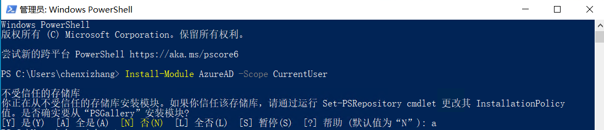
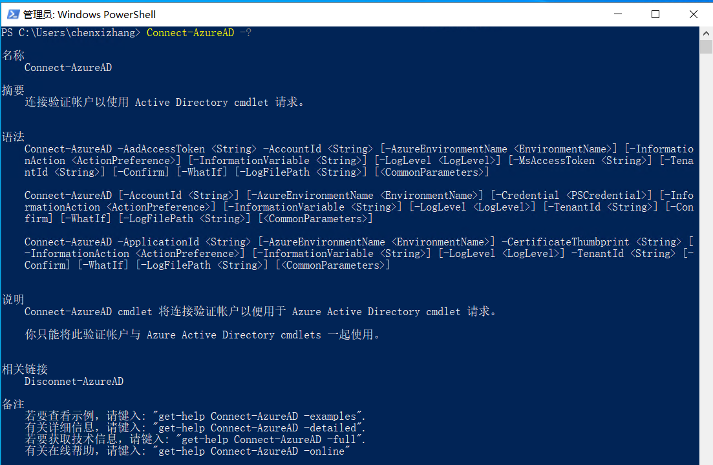
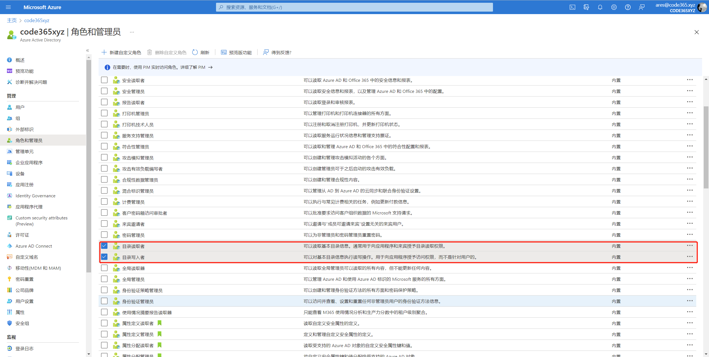
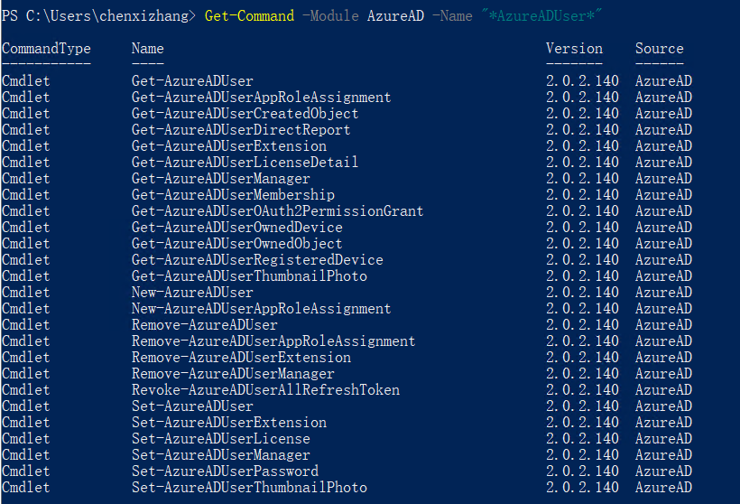
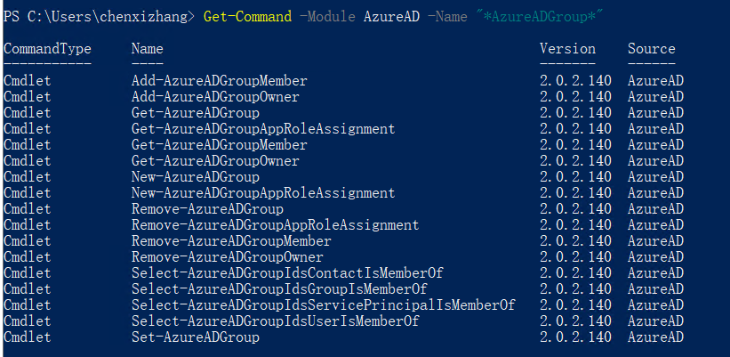
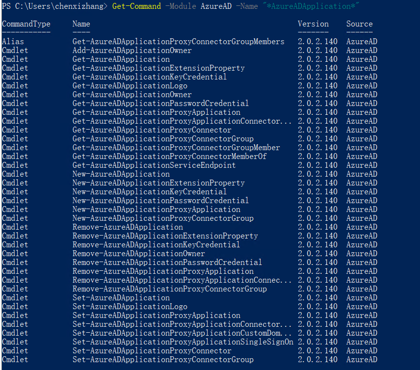
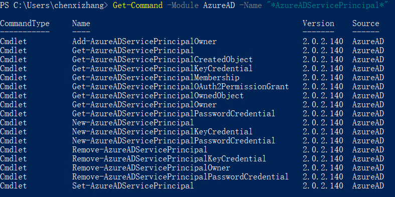
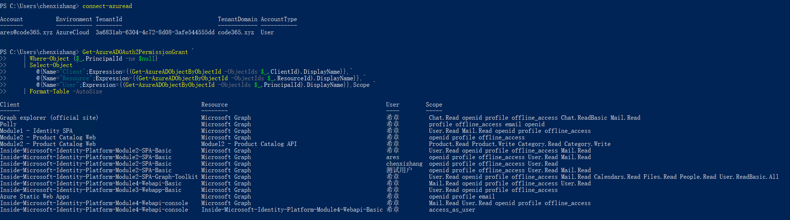
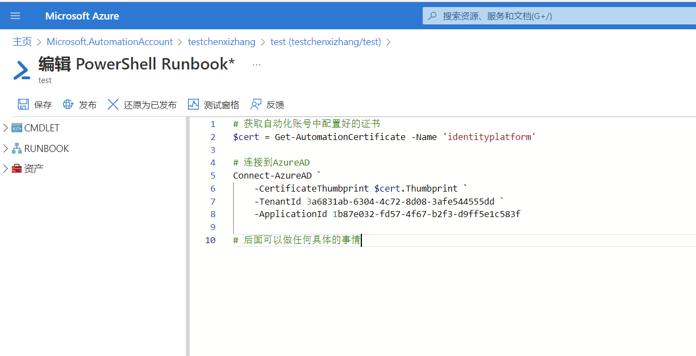

# 第九讲：使用 Azure AD PowerShell 模块
> **解密和实战 Microsoft Identity Platform**  https://identityplatform.xizhang.com


作者：陈希章
时间：2022年2月


## 课程大纲
<!--
footer: '**解密和实战 Microsoft Identity Platform**  https://identityplatform.xizhang.com'
-->

1. [基本概念](module1-overview.md)
1. [为单页应用程序集成 （`React`）](module2-spa.md)
1. [为Web应用程序集成 （`Node.js`）](module3-webapp.md)
1. [使用Microsoft Identity 保护Web API （`ASP.NET Core`）](module4-webapi.md)
1. [为移动或桌面应用程序集成 （`Xamarin, WPF`）](module5-desktop-mobile.md)
1. [为守护程序或后端服务集成 (`Azure function +Python，Power Automate`)](module6-deamon-service.md)
1. [Azure AD B2C应用集成 (`React，手机验证码登录和微信登录`） ](module7-b2c.md)
1. [使用 Microsoft Graph API (`Graph explorer & Postman`)](module8-msgraph.md)
1. **[使用 Azure AD PowerShell 模块 (`PowerShell`)](module9-powershell.md)**
1. [应用管理及最佳实践](module10-bestpractices.md)


## 使用 Azure AD PowerShell 模块

1. 安装模块
1. 连接到Azure AD
1. 用户和组管理
1. 应用程序管理
1. 综合管理

## 安装模块
<!-- https://docs.microsoft.com/zh-cn/powershell/module/azuread -->
使用Windows 10 自带的PowerShell即可。

```powershell
Install-Module AzureAD -Scope CurrentUser
```



## 连接到Azure AD

1. 使用用户身份连接
    普通用户也可以
1. 使用应用程序身份连接
    使用证书连接


## 连接到Azure AD
```powershell
Connect-AzureAD
Connect-AzureAD -Credential (Get-Credential) 
# 这里Credential甚至可以保存在本地，但不推荐
Connect-AzureAD -TenantId 91dde955-43a9-40a9-a406-694cffb04f28
Connect-AzureAD -AzureEnvironmentName AzureChinaCloud # 连接到中国版
```




### 使用证书连接到Azure AD
<!-- 

如果要用应用程序使用这个模块，则需要把对应的企业应用程序（ServicePricipal添加到Directory Read组），可能是因为这个模块不使用标准的 Graph权限，所以通过Graph的授权，即便管理员同意了也是无效的。

不是直接添加应用程序，而是把对应的企业应用程序（其实就是所谓的ServicePrincipal）添加到目录读取者的组。

Add-AzureADDirectoryRoleMember -ObjectId (Get-AzureADDirectoryRole | where-object {$_.DisplayName -eq "Directory Readers"}).Objectid -RefObjectId bf205446-c25d-426c-8a43-d7c7a02d8c23 -->

1. 注册应用程序
1. 将企业应用程序加入到 `目录读取者`或 `目录写入者`这两个角色
1. 配置证书（可以用自签名证书）
1. 使用如下命令连接

```powershell
Connect-AzureAD `
    -CertificateThumbprint A639157B5BBC31DC007CC014B077F8D70A082122 `
    -TenantId 3a6831ab-6304-4c72-8d08-3afe544555dd `
    -ApplicationId 1b87e032-fd57-4f67-b2f3-d9ff5e1c583f 
    # 需要在管理员模式下运行此命令。关于如何创建证书并且安装到AAD，请参考第六讲.
```



## 用户和组管理

1. 查询 / 创建 / 修改 / 删除用户
1. 查询 / 创建 / 添加和删除成员 /删除组

### 查询 / 创建 / 修改 / 删除用户

```powershell
Get-AzureADUser # 获取所有用户
New-AzureADUser # 创建新用户
Set-AzureADUser # 修改用户
Remove-AzureADUser # 删除用户
```



### 查询 / 创建 / 添加和删除成员 /删除组

```powershell
Get-AzureADGroup # 获取所有组
New-AzureADGroup # 创建组
Add-AzureADGroupMember # 添加成员
Remove-AzureADGroupMember # 删除成员
Set-AzureADGroup # 修改组
Remove-AzureADGroup # 删除组
```



## 应用程序管理

1. 创建 / 修改 / 删除 应用程序
1. 应用程序和企业应用程序





## 综合管理
```powershell
# 获取所有用户授权过哪些应用程序，分别是什么权限, 必要时可以使用 Remove-AzureADOAuth2PermissionGrant 进行删除
Get-AzureADOAuth2PermissionGrant `
    | Where-Object {$_.PrincipalId -ne $null} `
    | Select-Object `
        @{Name="Client";Expression={(Get-AzureADObjectByObjectId -ObjectIds $_.ClientId).DisplayName}},`
        @{Name="Resource";Expression={(Get-AzureADObjectByObjectId -ObjectIds $_.ResourceId).DisplayName}},`
        @{Name="User";Expression={(Get-AzureADObjectByObjectId -ObjectIds $_.PrincipalId).DisplayName}},Scope
```


## 云端自动化脚本执行
<!-- _footer: 详情请参考 https://docs.microsoft.com/zh-cn/azure/automation/overview -->

用Azure平台的 “自动化`Automation`”定期或按需执行脚本。

1. 创建自动化账号
1. 上传证书（私钥文件，pfx，并且设置可以导出私钥）
1. 编写脚本执行，使用Application连接



## 课程反馈

你可以通过邮件 <ares@xizhang.com> 与我取得联系，也可以关注 `code365xyz` 这个微信公众号给我留言，还可以在这里 (<https://github.com/chenxizhang/inside-microsoft-identity-platform/discussions>) 给我提出问题或讨论。


陈希章 于上海
2022年2月