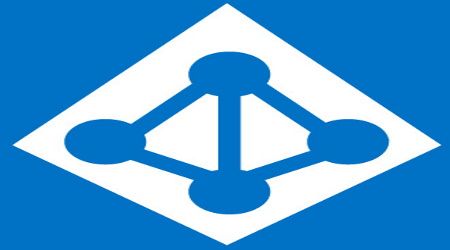
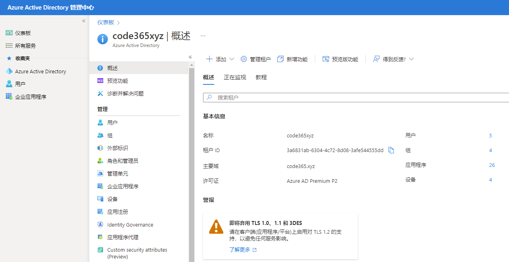
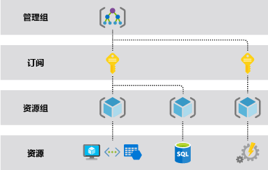
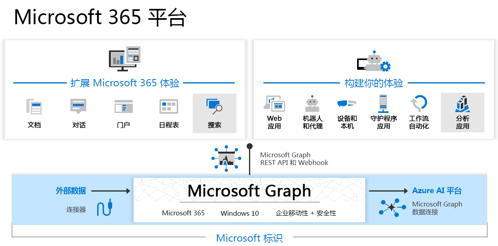
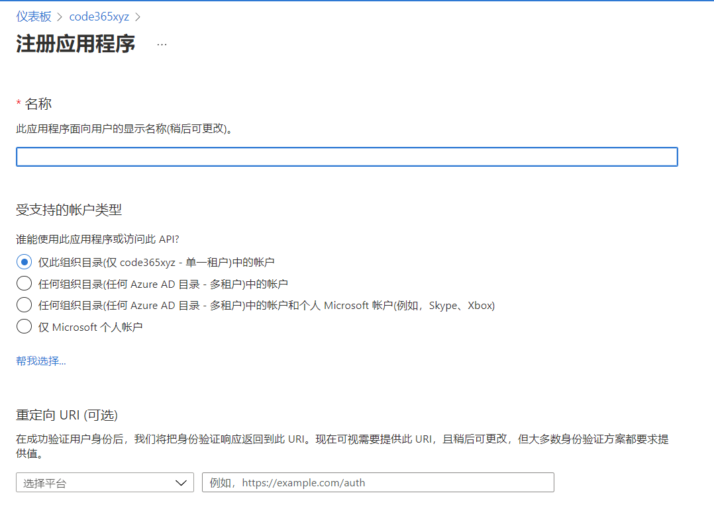
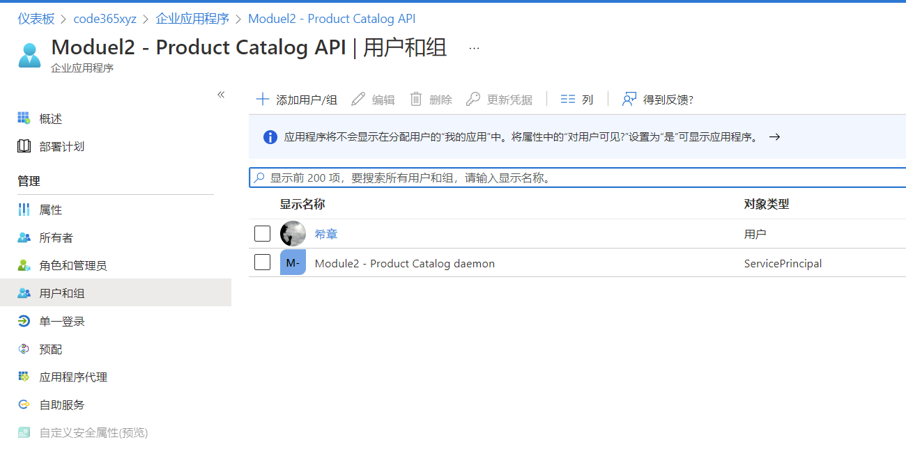
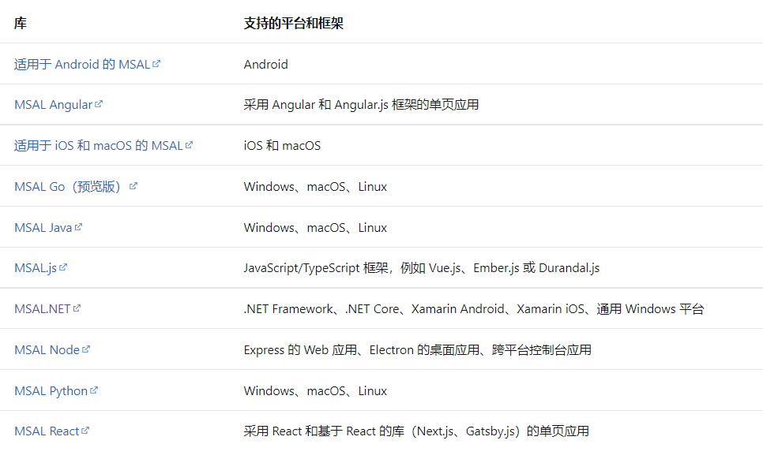

# 第一讲：基本概念
> **解密和实战 Microsoft Identity Platform**  https://identityplatform.xizhang.com

作者：陈希章
时间：2022年2月

## 课程大纲
<!--
footer: '**解密和实战 Microsoft Identity Platform**  https://identityplatform.xizhang.com'
-->

1. **[基本概念](module1-overview.md)**
1. [为单页应用程序集成 （`React`）](module2-spa.md)
1. [为Web应用程序集成 （`Node.js`）](module3-webapp.md)
1. [使用Microsoft Identity 保护Web API （`ASP.NET Core`）](module4-webapi.md)
1. [为移动或桌面应用程序集成 （`Xamarin, WPF`）](module5-desktop-mobile.md)
1. [为守护程序或后端服务集成 (`Azure function +Python，Power Automate`)](module6-deamon-service.md)
1. [Azure AD B2C应用集成 (`React，手机验证码登录和微信登录`） ](module7-b2c.md)
1. [使用 Microsoft Graph API (`Graph explorer & Postman`)](module8-msgraph.md)
1. [使用 Azure AD PowerShell 模块 (`PowerShell`)](module9-powershell.md)
1. [应用管理及最佳实践](module10-bestpractices.md)

## 基本概念

1. 租户（默认租户，多租户，B2B协作，B2C租户）
1. 资源（用户，组，设备，应用程序）
    - 延申了解（Azure，Microsoft Graph，自建）
1. 身份验证和授权流程

## 租户
<!-- 

关于租户的一些限制，请参考 https://docs.microsoft.com/en-us/azure/active-directory/enterprise-users/directory-service-limits-restrictions

租户的价格，请参考 https://azure.microsoft.com/en-us/pricing/details/active-directory/
 -->

这是一切的起点，它定义了组织和管理边界，以用户为主体和中心，同时包含了各种资源。

1. 默认租户
1. 多租户
    - B2B协作
1. 国际版 和 中国版
1. B2C租户

## 资源
<!-- _footer: '' -->

1. 租户基本资源
1. Azure 服务资源
1. Microsoft Graph 对象资源
1. 企业自建资源

### 租户基本资源 (Azure Active Directory)
<!-- _footer: ' ' -->

- Azure Active Directory （简称AAD）是本门课程的核心，它是Azure 平台的一部分。
- 基本资源包含用户，组，应用程序和设备。

### Azure服务资源
<!-- _footer: ' ' -->
Azure 是一个完整的IaaS，PaaS的平台，它在全球范围内提供了几百项服务，并且适合于各种规模的公司或个人使用，按需付费，随需应变。

### Microsoft Graph 对象资源
<!-- _footer: ' ' -->

### 企业自建资源
<!-- 可以想象一下，Microsoft Graph其实就是一系列微软自建的服务，整合进来而已 -->
- 将公司的自建服务通过Microsoft Identity Platform 保护起来
- 可以托管在任何地方，可以用任何语言编写
- 应用程序代理

## 身份验证和授权流程

1. 注册应用程序（决定受众范围，可接受的用户端，可访问资源和权限）
1. 管理员同意及分配用户和应用（可选）
1. 使用SDK完成身份验证和授权

## 注册应用程序
<!-- _footer: '' -->
<!-- 
    如果需要大量注册，则可以用脚本自动化 

    默认是所有人都可以注册，但可以关闭

    演示时可以用demo-开始，后续可以用powershell一次性删除 
    
    Get-AzureADApplication | Where-Object {$_.DisplayName -like 'demo-*'} | Remove-AzureADApplication
-->
1. 决定受众范围
1. 可接受的用户端
1. 声明资源和权限
    - 委托权限
    - 应用权限

## 管理员同意，分配用户和应用 (可选)
<!-- 
应用权限需要管理员同意，部分委托权限也可能需要。

同意了后，用户不会受到提醒。

多租户应用可能需要。 

如果要控制级别，请到：企业应用程序 | 用户设置， 许可和权限 | 用户同意设置

可以在界面上操作，也可以通过一个特殊的地址进行管理员同意
-->
1. 什么时候需要管理员同意
1. 如何控制管理员同意级别
1. 如何进行管理员同意
1. 如何分配用户和应用访问

## 使用OAuth2,OpenID connect 和 SDK 进行编程
<!-- _footer: '' -->
<!-- 
    注册好应用后，可以看到属性中的端点信息，可以理解Oauth的一些基本知识。但真正开发时大部分都直接用SDK
 -->

## 课程反馈

你可以通过邮件 <ares@xizhang.com> 与我取得联系，也可以关注 `code365xyz` 这个微信公众号给我留言，还可以在这里 (<https://github.com/chenxizhang/inside-microsoft-identity-platform/discussions>) 给我提出问题或讨论。

陈希章 于上海
2022年2月