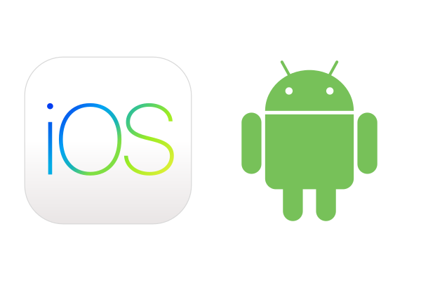
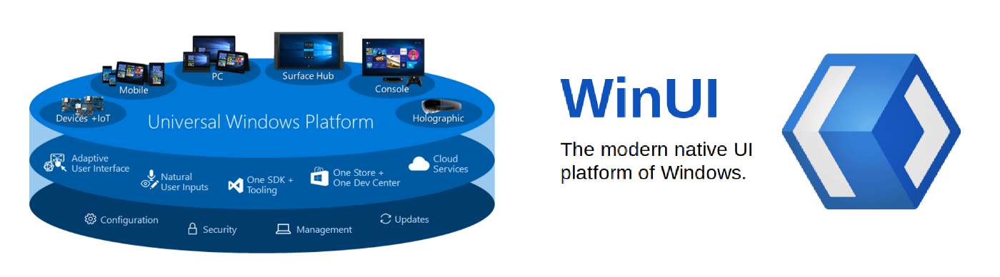
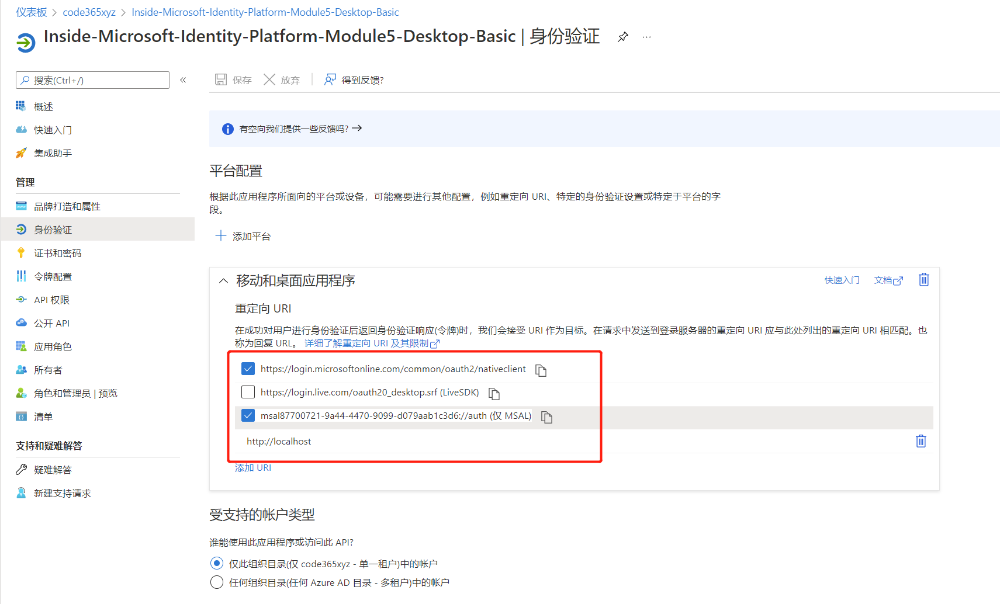
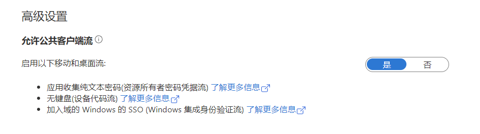
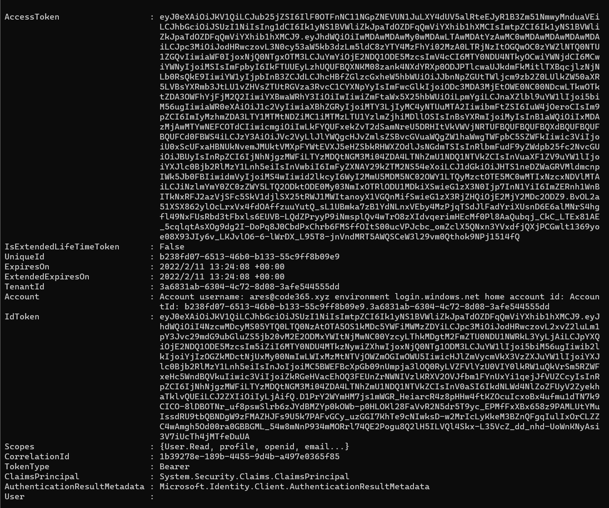

# 第五讲：为移动或桌面应用集成
> **解密和实战 Microsoft Identity Platform**  https://identityplatform.xizhang.com


作者：陈希章
时间：2022年2月


## 课程大纲
<!--
footer: '**解密和实战 Microsoft Identity Platform**  https://identityplatform.xizhang.com'
-->

1. [基本概念](module1-overview.md)
1. [为单页应用程序集成 （`React`）](module2-spa.md)
1. [为Web应用程序集成 （`Node.js`）](module3-webapp.md)
1. [使用Microsoft Identity 保护Web API （`ASP.NET Core`）](module4-webapi.md)
1. **[为移动或桌面应用程序集成 （`Xamarin, WPF, Console`）](module5-desktop-mobile.md)**
1. [为守护程序或后端服务集成 (`Azure function +Python，Power Automate`)](module6-deamon-service.md)
1. [Azure AD B2C应用集成 (`React，手机验证码登录和微信登录`） ](module7-b2c.md)
1. [使用 Microsoft Graph API (`Graph explorer & Postman`)](module8-msgraph.md)
1. [使用 Azure AD PowerShell 模块 (`PowerShell`)](module9-powershell.md)
1. [应用管理及最佳实践](module10-bestpractices.md)

## <!-- fit --> 为移动或桌面应用程序集成

1. 注册应用程序
1. 初始化应用程序
1. 利用SDK进行编程
    1. 使用交互式身份验证
    1. 使用Windows集成验证
    1. 使用用户名和密码
    1. 使用设备代码
1. 利用PowerShell进行编程






## 注册应用程序
<!-- _footer: '' -->


注意重定向地址

## 初始化应用程序

1. 安装 `Microsoft.Identity.Client` 和 `Microsoft.Graph`
1. 创建 PublicClientApplication

    ```csharp
    using Microsoft.Graph;
    using Microsoft.Identity.Client;

    var scopes = new[] { "User.Read" };
    var tenantId = "3a6831ab-6304-4c72-8d08-3afe544555dd";
    var clientId = "87700721-9a44-4470-9099-d079aab1c3d6";

    var pca = PublicClientApplicationBuilder
        .Create(clientId)
        .WithTenantId(tenantId)
        .WithRedirectUri("http://localhost")
        .Build();

    ```

## 身份认证和访问资源的流程
<!-- _footer: '' -->
1. 构建 `authProvider`，有四种方式
    - 交互式 
    - Windows集成 
    - 用户名和密码 
    - 设备代码
1. 构建 `GraphServiceClient`, 使用SDK进行编程方式



## 使用交互式身份验证

:heart: 最为推荐的方式 : `pca.AcquireTokenInteractive`  

```csharp
var authProvider = new DelegateAuthenticationProvider(async (request) =>
{
    var result = await pca.AcquireTokenInteractive(scopes)
        .ExecuteAsync();
    request.Headers.Authorization =
        new System.Net.Http.Headers.AuthenticationHeaderValue("Bearer", result.AccessToken);
});

var graphClient = new GraphServiceClient(authProvider);
var me = await graphClient.Me.Request().GetAsync();
Console.WriteLine(me.DisplayName);
```

## 使用Windows集成验证

自动读取当前Windows身份。限制较多：要求用域账号登录，并且跟AAD做了同步。

```csharp
var authProvider = new DelegateAuthenticationProvider(async (request) =>
{
    var result = await pca.AcquireTokenByIntegratedWindowsAuth(scopes).ExecuteAsync();
    request.Headers.Authorization =
        new System.Net.Http.Headers.AuthenticationHeaderValue("Bearer", result.AccessToken);
});
var graphClient = new GraphServiceClient(authProvider);
var me = await graphClient.Me.Request().GetAsync();
Console.WriteLine(me.DisplayName);

```

## 使用用户名和密码
<!-- _footer: '' -->
某些情况下好用，不需要弹出任何界面。
```csharp
Console.WriteLine("请输入用户名");
var username = Console.ReadLine();
SecureString securePwd = new SecureString();
ConsoleKeyInfo key;

Console.WriteLine("请输入密码");
do{
    key = Console.ReadKey(true);
    securePwd.AppendChar(key.KeyChar);
    Console.Write("*");
} while (key.Key != ConsoleKey.Enter);

var authProvider = new DelegateAuthenticationProvider(async (request) =>
{
    var result = await pca.AcquireTokenByUsernamePassword(scopes, username, securePwd).ExecuteAsync();
    request.Headers.Authorization =
        new System.Net.Http.Headers.AuthenticationHeaderValue("Bearer", result.AccessToken);
});

var graphClient = new GraphServiceClient(authProvider);
var me = await graphClient.Me.Request().GetAsync();
Console.WriteLine(me.DisplayName);
```

## 使用设备代码

```csharp
var authProvider = new DelegateAuthenticationProvider(async (request) =>
{
    var result = await pca.AcquireTokenWithDeviceCode(scopes, r =>
    {
        return Task.FromResult(0);
    }).ExecuteAsync();
    request.Headers.Authorization =
        new System.Net.Http.Headers.AuthenticationHeaderValue("Bearer", result.AccessToken);
});

var graphClient = new GraphServiceClient(authProvider);
var me = await graphClient.Me.Request().GetAsync();
Console.WriteLine(me.DisplayName);

```


## 利用  进行编程

```powershell
Install-Module -Name MSAL.PS -Scope CurrentUser
# MSAL.PS 不是官方库，但也是由微软员工编写的

$token = Get-MsalToken `
    -ClientId 87700721-9a44-4470-9099-d079aab1c3d6 `
    -TenantId 3a6831ab-6304-4c72-8d08-3afe544555dd `
    -Scopes Mail.read

# 这里会弹出对话框进行身份验证
# 有了 AccessToken 就可以做服务调用了，通过REST接口即可

curl -Uri "https://graph.microsoft.com/v1.0/me/messages" `
    -Headers @{"Authorization"="Bearer $($token.AccessToken)"} `
    -UseBasicParsing

# 如果后续目的纯粹是为了访问MicrosoftGraph, 则可以安装下面的模块 
Install-Module Microsoft.Graph -Scope CurrentUser

# 详情参考 
https://docs.microsoft.com/zh-cn/graph/powershell/get-started
```




## 课程反馈

你可以通过邮件 <ares@xizhang.com> 与我取得联系，也可以关注 `code365xyz` 这个微信公众号给我留言，还可以在这里 (<https://github.com/chenxizhang/inside-microsoft-identity-platform/discussions>) 给我提出问题或讨论。


陈希章 于上海
2022年2月