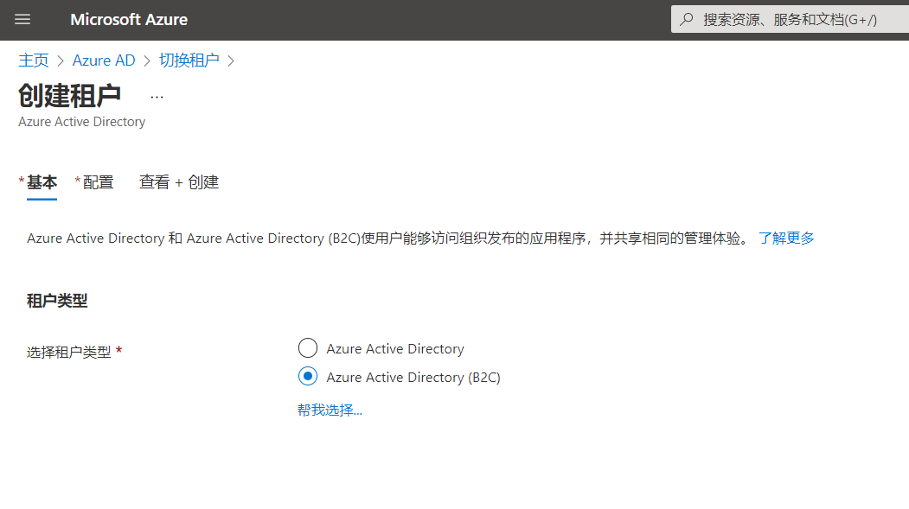
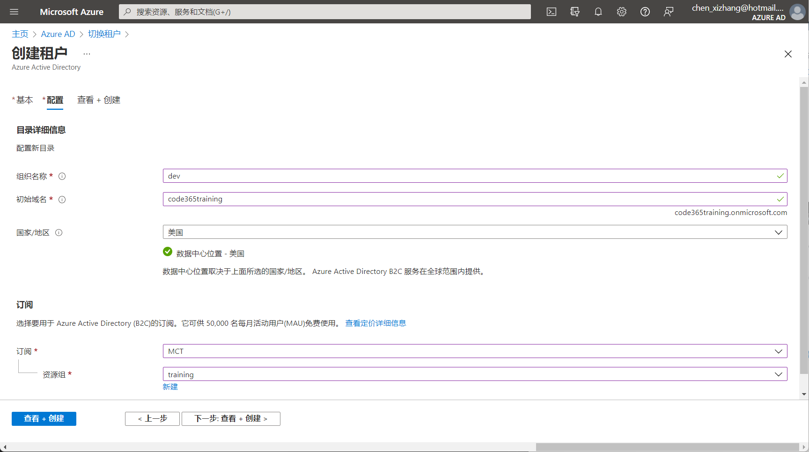
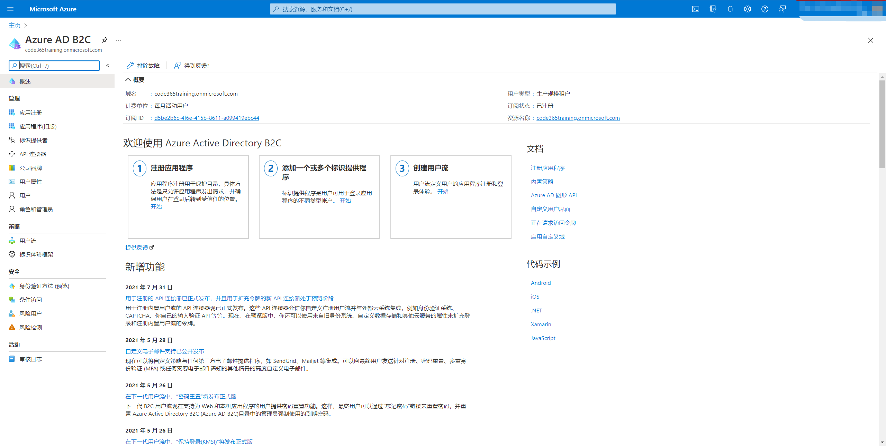
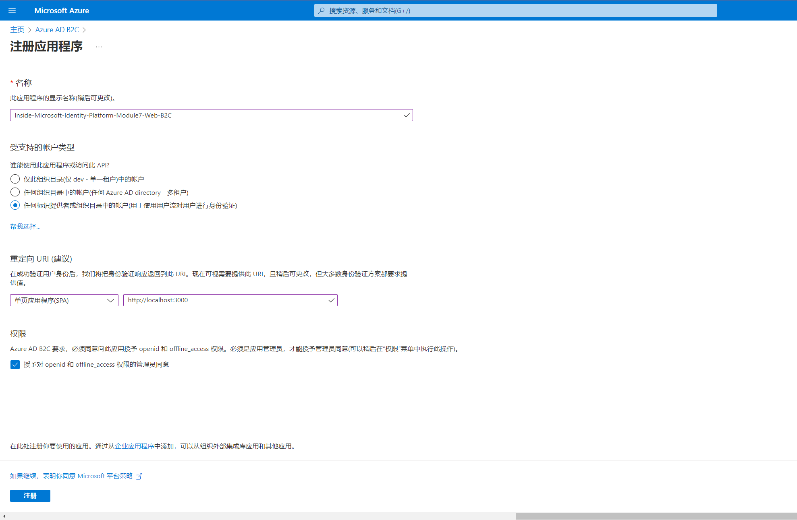

# 第七讲：Azure AD B2C应用集成 
> **解密和实战 Microsoft Identity Platform**  https://identityplatform.xizhang.com

作者：陈希章
时间：2022年2月

## 课程大纲
<!--
footer: '**解密和实战 Microsoft Identity Platform**  https://identityplatform.xizhang.com'
-->

1. [基本概念](module1-overview.md)
1. [为单页应用程序集成 （`React`）](module2-spa.md)
1. [为Web应用程序集成 （`Node.js`）](module3-webapp.md)
1. [使用Microsoft Identity 保护Web API （`ASP.NET Core`）](module4-webapi.md)
1. [为移动或桌面应用程序集成 （`Xamarin, WPF`）](module5-desktop-mobile.md)
1. [为守护程序或后端服务集成 (`Azure function +Python，Power Automate`)](module6-deamon-service.md)
1. **[Azure AD B2C应用集成 (`React，手机验证码登录和微信登录`） ](module7-b2c.md)**
1. [使用 Microsoft Graph API (`Graph explorer & Postman`)](module8-msgraph.md)
1. [使用 Azure AD PowerShell 模块 (`PowerShell`)](module9-powershell.md)
1. [应用管理及最佳实践](module10-bestpractices.md)

## <!-- fit -->  Azure AD B2C应用集成
1. 创建租户
1. 注册应用程序
1. 选择身份提供程序
1. 定义用户流
1. 编程访问

##  创建租户

1. 需要有一个合法的订阅
1. 会产生少量每月费用

## 创建租户 （续）
<!-- _footer: '' -->

## 注册应用程序
<!-- _footer: '' -->

## 课程反馈

你可以通过邮件 <ares@xizhang.com> 与我取得联系，也可以关注 `code365xyz` 这个微信公众号给我留言，还可以在这里 (<https://github.com/chenxizhang/inside-microsoft-identity-platform/discussions>) 给我提出问题或讨论。

陈希章 于上海
2022年2月